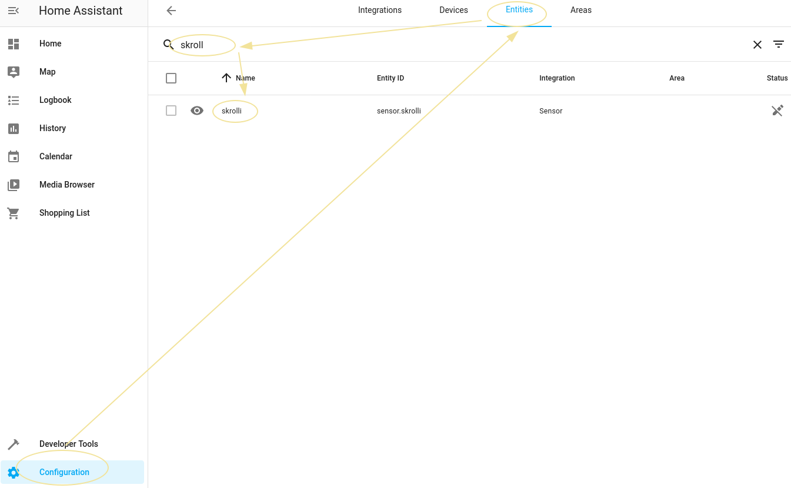
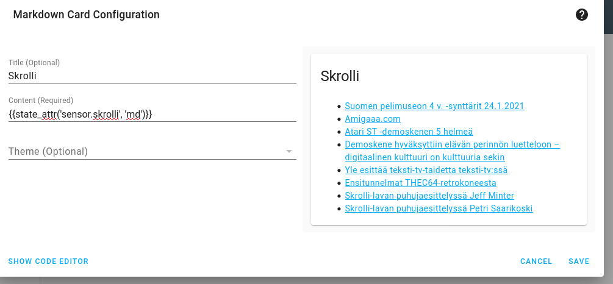

[](https://github.com/joonas-fi/rss-to-homeassistant/releases)

Pushes RSS feeds into Home Assistant as Markdown, so they can be displayed natively.

For more background, see my [blog post](https://joonas.fi/2020/08/displaying-rss-feed-with-home-assistant/).


Prerequisites
-------------

You need:

- Home Assistant
- Home Assistant needs to be connected to a MQTT server
- Download & run this software, `rss-to-homeassistant`


Configuration
-------------

You need to create `config.json`:

```json
{
	"mqtt_addr": "192.168.1.3:1883",
	"rss_feeds": [
		{
			"id": "skrolli",
			"url": "https://skrolli.fi/feed/"
		}
	]
}
```


How to use
----------

You've created the configuration file.

Now after starting, if everything goes well, you should see this message:

```console
$ ./rss-to-homeassistant
2021/03/22 07:45:30 [INFO] skrolli changed
```

The RSS feed should've just popped into Home Assistant (because we use its
[autodiscovery](https://www.home-assistant.io/docs/mqtt/discovery/) mechanism to advertise the feeds):



This means that Home Assistant has the Markdown content of the RSS feed. We're close to the finish line.


Displaying the feed's Markdown content
--------------------------------------

You need to add a Markdown card, with content that has a dynamic placeholder to display the feed
entity's Markdown content:



You're done!


Keep this running across system restarts
----------------------------------------

If you're on Linux, we have a helper to integrate with systemd:

```console
./rss-to-homeassistant install-as-service
Wrote unit file to /etc/systemd/system/rss-to-homeassistant.service
Run to enable on boot & to start (--)now:
	$ systemctl enable --now rss-to-homeassistant
Verify successful start:
	$ systemctl status rss-to-homeassistant
```


TODO
----

- Some of the code was hurriedly extracted from [Hautomo](https://github.com/function61/hautomo), so it
  might not make sense. Needs minor cleanups.
- Consider polling interval, 1 minute might be too often
- Implement HTTP caching to be nice to RSS publishers
